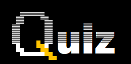
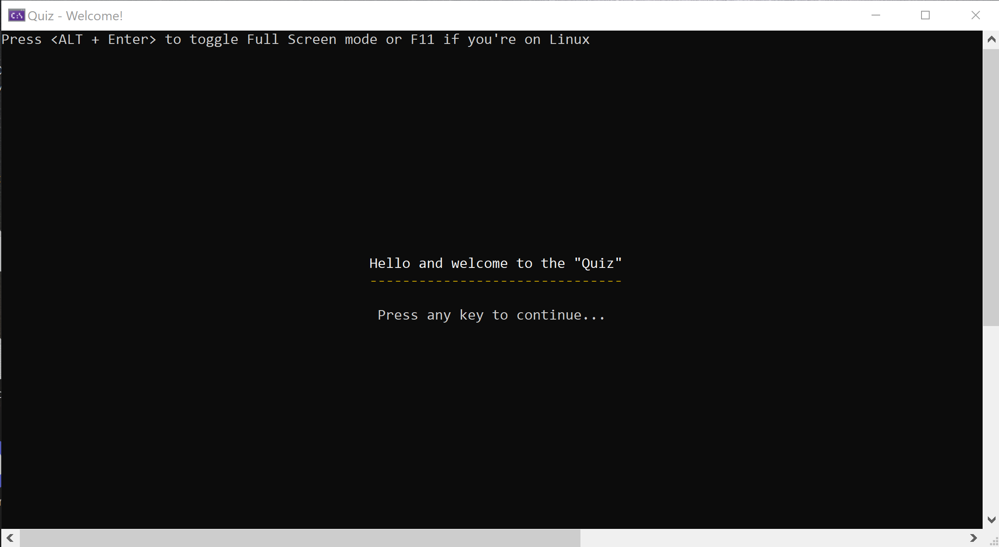

  

[![Badge License]][License]   


<!----------------------------------{ Licenses }------------------------------->

[License]: https://en.wikipedia.org/wiki/MIT_License


<!----------------------------------{ Badges }--------------------------------->

[Badge License]: https://img.shields.io/badge/License-MIT-yellow.svg?style=for-the-badge


The "Quiz" app allows users to play a quiz game and\
determine a winner based on a high score.\
It was primarily designed as a job interview preparation tool,\
but it can be used in any similar scenario.\
The app consists of a **class library** which contains all the models,\
a **console app** user interface, and a **Web API** to interact\
with other applications i.e. Android app or a single page web app.

<details>
  <summary><i>UI Screenshots</i></summary>




</details>

## How to build and run

1. In your terminal window go the folder containing the QuizGameApp.\
Assume this is Documents/QuizGameApp/QuizGameConsole in a user's home directory:
>This will work for Bash and PowerShell both on Linux and Windows:
>```
>cd ~/Documents/QuizGameApp/QuizGameConsole
>```

2. Build the app with the following command:
>```
>dotnet build
>```
3. Run the app with the following command:
>```
>dotnet run
>```
4. (OPTIONAL) You can also pass command line arguments on start.\
Make sure you add your arguments after the "--" symbol sequence.
>example for "-p" argument:
>```
>dotnet run -- -p
>```
> example for "--help" argument:
>```
>dotnet run -- --help
>```

## How to publish and run

1. In your terminal window go the folder containing the app.\
Assume this is Documents/QuizGameApp in a user's home directory:
>This will work for Bash and PowerShell both on Linux and Windows:
>```
>cd ~/Documents/QuizGameApp
>```

2. Publish the app with the following command:
> For Windows:
>```
>dotnet publish -c Release -r win-x64 --self-contained false
>```
> For Linux:
>```
>dotnet publish -c Release -r linux-x64 --self-contained false
>```

3. Navigate to the published folder.
>
> On Windows:
>```
>cd QuizGameConsole\bin\Release\net7.0\win-x64
>```
>On Linux:
>```
>cd QuizGameConsole/bin/Release/net7.0/linux-x64
>```

4. Run the app:
>
> On Windows:
>```
> .\QuizGameConsole.exe
>```
>On Linux:
>```
>dotnet QuizGameConsole.dll
>```

5. (Optional) you can use "-p" console argument\
to enable persistent data mode for CSV\
or "--database" for SQLite data storage
>
> On Windows:
>```
> .\QuizGameConsole.exe -p
>```
>On Linux:
>```
>dotnet QuizGameConsole.dll -p
>```

6. If any trouble you can use built in help:
>
> On Windows:
>```
> .\QuizGameConsole.exe --help
>```
>On Linux:
>```
>dotnet QuizGameConsole.dll --help
>```

## Regular mode

In regular mode when no command line arguments provided\
the app does not load or save any data.\
The data persists during the game and deletes on exit.

## Persistent Mode

In persistent mode the app reads data from 2 CSV files or database\
file located in the same folder. If the file does not exists the app creates it.\
The app rewrites the files with new data on exit.

> Use **-p** command line argument for CSV persistent mode

> Use **--database** command line argument for database persistent mode

## How run tests
1. In your terminal window go the folder containing the source code.\
Execute the build command first:
>```
>dotnet build
>```
2. Run tests with the following command:
>```
>dotnet test
>```

## Dependencies

- the Models Library targets **.Net Standard 2.0** specification
- The Quiz Console App targets **.NET 7**
